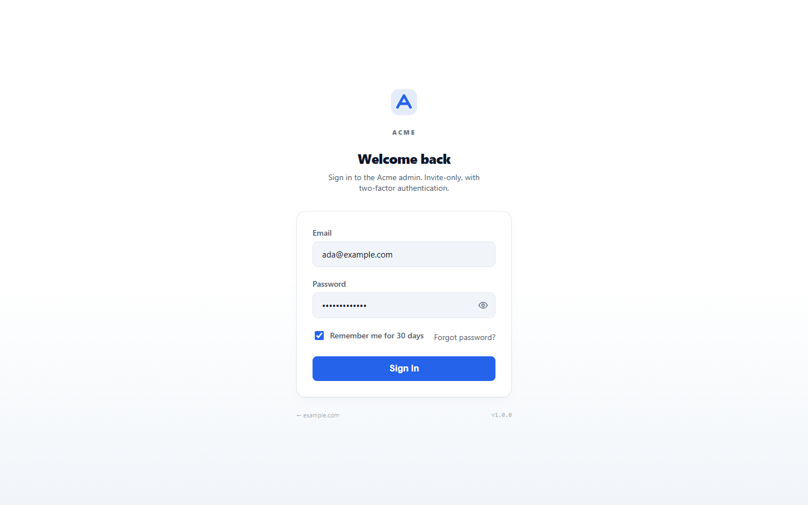
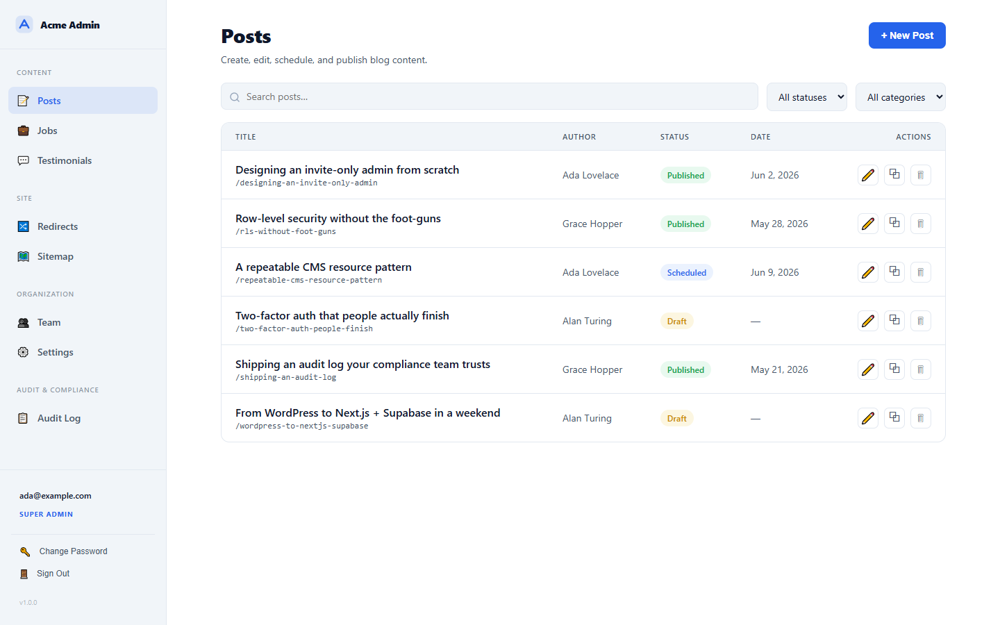

# Website CMS Kit

A complete, production-grade **admin / authentication / CMS backend** for a Next.js (App Router) + Supabase site, packaged as a reference you can study and reproduce on your own project.

It is the real backend of a production marketing site, extracted faithfully and white-labeled. Not a library you `npm install` — a worked example you read, understand, and adapt. Everything here runs on just Next.js and Supabase: no third-party CMS, no separate backend service.

## What it looks like

White-labeled mockups (placeholder brand "Acme"), built from the kit's own neutral design tokens. Full visual tour + the standalone HTML in [`demo/`](demo/).

| Admin login | Admin dashboard (Posts) |
|---|---|
| [](demo/login.html) | [](demo/dashboard.html) |

Invite-only auth with two-factor, a sectioned admin shell with role-aware nav, and the repeatable CMS list pattern (search, filters, status chips, row actions). Every color comes from one re-themeable token layer ([`source/app/globals.css`](source/app/globals.css)).

## What you get

- **Invite-only auth** — email + password over `@supabase/ssr` cookie sessions, mandatory TOTP two-factor with bcrypt-hashed recovery codes, password reset, and forced MFA enrollment after a grace window. No password is ever emailed.
- **Role-based authorization** — `super_admin` / `admin` roles, soft-deactivation, and hardened Postgres RLS using `SECURITY DEFINER` helper functions (the correct, recursion-free Supabase pattern).
- **Team management** — invite, change role, deactivate/reactivate, operator-initiated password recovery, with a "cannot remove the last super-admin" guard.
- **Audit log** — append-only forensic record of every sensitive mutation, with a filterable viewer and CSV export.
- **A repeatable CMS resource pattern** — index + create + edit + server actions + RLS, demonstrated with four real resources: blog posts (TipTap rich-text editor, autosave, optional AI generation), jobs, testimonials, and a URL redirect manager.
- **A polished, accessible admin shell** — responsive sidebar/drawer, focus-trapped modals, optimistic toggles, a neutral design-token system you re-theme in one file, and Supabase Storage image upload.
- **One consolidated SQL migration** that stands the whole thing up on a fresh Supabase project.

## 60-second tour

```
website-cms-kit/
  docs/        Read these. Start with 01-architecture.md.
  source/      The genericized source files, mirrored at the paths they belong
               at in a Next.js app's src/ directory.
  .env.example The environment variables the admin surface needs.
```

The three-layer security model in one breath: a **proxy** refreshes the session and bounces unauthenticated `/admin/*` requests; a **server gate** (`requireAdmin()`) re-checks role + deactivation + MFA on every protected render and mutation; **RLS** in Postgres is the final word, allowing only admin-or-above writes and anon reads of published rows. Each layer can deny on its own.

## How to use this

1. Read [docs/01-architecture.md](docs/01-architecture.md) for the mental model.
2. Skim [docs/02-authentication.md](docs/02-authentication.md) and [docs/03-authorization-and-rls.md](docs/03-authorization-and-rls.md) — the two highest-value, easiest-to-get-wrong parts.
3. Follow [docs/07-reproduction-runbook.md](docs/07-reproduction-runbook.md) to stand it up on a fresh Next.js 16 + Supabase project.
4. Use [docs/05-cms-resource-pattern.md](docs/05-cms-resource-pattern.md) to add your own content types.
5. Gate your launch on [docs/08-security-checklist.md](docs/08-security-checklist.md).

## Documentation

| Doc | Covers |
|---|---|
| [01-architecture.md](docs/01-architecture.md) | The mental model, request lifecycle, directory map. |
| [02-authentication.md](docs/02-authentication.md) | Sessions, the four client factories, the proxy gate, every auth flow. |
| [03-authorization-and-rls.md](docs/03-authorization-and-rls.md) | Roles, the SECURITY DEFINER pattern, the standard RLS policy set, the audit log. |
| [04-team-management.md](docs/04-team-management.md) | Invite, role change, deactivate, recover. |
| [05-cms-resource-pattern.md](docs/05-cms-resource-pattern.md) | The repeatable resource shape + an "add your own" checklist. |
| [06-admin-shell-and-ui.md](docs/06-admin-shell-and-ui.md) | Shell, nav, primitives, design tokens, image upload. |
| [07-reproduction-runbook.md](docs/07-reproduction-runbook.md) | Step-by-step setup on a fresh project. |
| [08-security-checklist.md](docs/08-security-checklist.md) | The non-negotiables before you go live. |
| [09-environment-and-deploy.md](docs/09-environment-and-deploy.md) | Env vars, Supabase config, dependency classification, deploy. |

## Tech stack

Next.js 16 (App Router) · TypeScript · Supabase (Postgres + Auth + Storage) · `@supabase/ssr` · Tailwind v4 · TipTap · zod · react-hook-form · sonner · lucide-react · bcryptjs. Optional: `@anthropic-ai/sdk` for AI content generation.

## Status and provenance

Extracted from a production Next.js + Supabase marketing site and genericized for public release. All brand names, domains, emails, secrets, and infrastructure identifiers have been removed; the placeholder brand is "Acme" on `example.com`. The code is faithful to the original system's structure and behavior.

It is a reference example, not a maintained package — there is no install target and no guarantee the extracted tree compiles standalone. The runbook explains how to wire it into a real app, where it does run.

## License

MIT. See [LICENSE](LICENSE).
