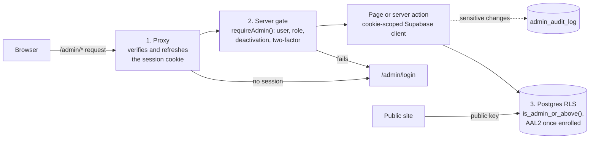

# Website CMS Kit

A complete, production-grade **admin, authentication and CMS backend** for a Next.js (App Router) and Supabase site, packaged as a reference you can study and reproduce on your own project.

It is the real backend of a production marketing site, extracted faithfully and white-labeled. Not a library you `npm install`: a worked example you read, understand and adapt. Everything here runs on Next.js and Supabase alone, with no third-party CMS and no separate backend service.

## Try it: interactive demo

**▶ https://robbrautigam.github.io/website-cms-kit/demo/**

A working version of the admin that runs entirely in your browser. Sign in with the pre-filled form (any password works), enter the two-factor code `123456`, then edit a post, preview it, publish it, upload an image, invite a teammate and watch every step land in the audit log.

**Sample data only.** Everything in the demo is invented, saved only in your browser's local storage, and never sent anywhere. A few screens preview proposed features that are not in the source yet; the demo marks them **Proposed**. Details in [`demo/README.md`](demo/README.md).

| Posts | Editor |
|---|---|
| [](https://robbrautigam.github.io/website-cms-kit/demo/app/#/posts) | [](https://robbrautigam.github.io/website-cms-kit/demo/app/#/posts) |
| **Audit log** | **Dark theme** |
| [](https://robbrautigam.github.io/website-cms-kit/demo/app/#/audit) | [](https://robbrautigam.github.io/website-cms-kit/demo/app/#/posts) |

### A five-minute walkthrough

1. **Sign in.** Press Sign in, then enter `123456`. The two-factor step also offers a recovery code; using one turns two-factor off and makes you set it up again, as the real kit does.
2. **Edit a post.** Open "How we review a post before it goes live", change a heading, add a link, insert an image. "Saved in this browser" shows autosave working.
3. **Preview.** Preview the post, or open Site preview (proposed) to see the whole site with every staged change, live and staging side by side.
4. **Publish.** Publish from the editor, schedule for later, or publish selected changes from Site preview.
5. **Team and audit.** Invite someone, change a role, try to demote the last super admin (refused), then find every step in the Audit log and export it.
6. **Start over.** "Reset demo data" in the sidebar puts everything back.

## What you get

- **Invite-only auth.** Email and password over `@supabase/ssr` cookie sessions, mandatory TOTP two-factor with bcrypt-hashed recovery codes, password reset, and forced two-factor enrollment after a grace window. No password is ever emailed.
- **Role-based authorization.** `super_admin` and `admin` roles, soft deactivation, and hardened Postgres RLS using `SECURITY DEFINER` helper functions (the recursion-free Supabase pattern).
- **Team management.** Invite, change role, deactivate and reactivate, operator-initiated password recovery, and a "cannot remove the last super admin" guard.
- **Audit log.** An append-only record of every sensitive change, with a filterable viewer and CSV export.
- **A repeatable CMS resource pattern.** Index, create, edit, server actions and RLS, shown with four real resources: blog posts (TipTap rich-text editor, local autosave, draft, scheduled and published states, optional AI drafting), jobs, testimonials, and a URL redirect manager.
- **An accessible admin shell.** Responsive sidebar and drawer, focus-trapped modals, optimistic toggles, a neutral design-token system you re-theme in one file, and Supabase Storage image upload guarded by Storage RLS.
- **One consolidated SQL migration** that stands the whole thing up on a fresh Supabase project, image bucket included.

## How a request is checked

Three layers. Each refuses on its own what it checks, and the database is the layer every write passes through:


```mermaid
flowchart LR
  B["Browser"] -->|"/admin/* request"| P["1. Proxy<br/>verifies and refreshes<br/>the session cookie"]
  P -->|"no session"| L["/admin/login"]
  P --> G["2. Server gate<br/>requireAdmin(): user, role,<br/>deactivation, two-factor"]
  G -->|"fails"| L
  G --> S["Page or server action<br/>cookie-scoped Supabase client"]
  S --> R[("3. Postgres RLS<br/>is_admin_or_above(),<br/>AAL2 once enrolled")]
  S -.->|"sensitive changes"| A[("admin_audit_log")]
  V["Public site"] -->|"public key"| R
```

1. **The proxy** (`source/proxy.ts`) verifies and refreshes the session on every `/admin/*` request and bounces anyone without one to the login page.
2. **The server gate** (`requireAdmin()`) re-checks the user, their role, whether they were deactivated and whether two-factor is complete, on every protected page and every server-side mutation. API routes call it themselves, because the proxy does not cover `/api/*`. The editor's browser-side writes (posts, image uploads) skip this layer, so layer 3 carries the two-factor check for them.
3. **Row-level security** in Postgres is the final word: only active admins can write, an admin with two-factor set up needs a completed two-factor session for any admin read or write (tables and image bucket alike), and the public key can read published rows only. A leaked public key or a stolen password alone cannot change anything.

The full model, what it does not cover, and how to report a problem: [SECURITY.md](SECURITY.md).

## 60-second tour

```
website-cms-kit/
  docs/        Read these. Start with 01-architecture.md.
  source/      The genericized source files, mirrored at the paths they belong
               at in a Next.js app's src/ directory.
  demo/        The interactive browser demo (sample data only).
  .env.example The environment variables the admin surface needs.
```

## How to use this

1. Read [docs/01-architecture.md](docs/01-architecture.md) for the mental model.
2. Skim [docs/02-authentication.md](docs/02-authentication.md) and [docs/03-authorization-and-rls.md](docs/03-authorization-and-rls.md), the two highest-value, easiest-to-get-wrong parts.
3. Follow [docs/07-reproduction-runbook.md](docs/07-reproduction-runbook.md) to stand it up on a fresh Next.js 16 and Supabase project.
4. Use [docs/05-cms-resource-pattern.md](docs/05-cms-resource-pattern.md) to add your own content types.
5. Gate your launch on [docs/08-security-checklist.md](docs/08-security-checklist.md).

## Documentation

| Doc | Covers |
|---|---|
| [01-architecture.md](docs/01-architecture.md) | The mental model, request lifecycle, directory map. |
| [02-authentication.md](docs/02-authentication.md) | Sessions, the four client factories, the proxy gate, every auth flow. |
| [03-authorization-and-rls.md](docs/03-authorization-and-rls.md) | Roles, the SECURITY DEFINER pattern, the standard RLS policy set, the audit log. |
| [04-team-management.md](docs/04-team-management.md) | Invite, role change, deactivate, recover. |
| [05-cms-resource-pattern.md](docs/05-cms-resource-pattern.md) | The repeatable resource shape and an "add your own" checklist. |
| [06-admin-shell-and-ui.md](docs/06-admin-shell-and-ui.md) | Shell, nav, primitives, design tokens, image upload. |
| [07-reproduction-runbook.md](docs/07-reproduction-runbook.md) | Step-by-step setup on a fresh project. |
| [08-security-checklist.md](docs/08-security-checklist.md) | The non-negotiables before you go live: secrets, RLS, gates, Storage, headers, rate limits. |
| [09-environment-and-deploy.md](docs/09-environment-and-deploy.md) | Env vars (both Supabase key generations), Supabase config, dependency classification, deploy. |

## Tech stack

- Next.js 16 (App Router) and TypeScript
- Supabase: Postgres, Auth and Storage, through `@supabase/ssr` 0.10 or later
- Tailwind CSS v4
- TipTap 3 (rich text)
- zod, react-hook-form, sonner, lucide-react, bcryptjs, server-only
- Optional: `@anthropic-ai/sdk` for AI drafting

The patterns were checked on 2026-10-08 against the releases current that day: Next.js 16 (16.4.0 is the newest; the changed files were type-checked against 16.3.8), `@supabase/ssr` 0.12.7, `@supabase/supabase-js` 2.117 and TipTap 3.31.4. What changed and why is in the [CHANGELOG](CHANGELOG.md).

## Status and provenance

Extracted from a production Next.js and Supabase marketing site and genericized for public release. All brand names, domains, emails, secrets and infrastructure identifiers have been removed; the placeholder brand is "Acme" on `example.com`. The code is faithful to the original system's structure and behavior.

It is a reference example, not a maintained package: there is no install target and no guarantee the extracted tree compiles standalone. The runbook explains how to wire it into a real app, where it does run.

## License

MIT. See [LICENSE](LICENSE). The demo bundles TipTap (MIT); see [demo/vendor/THIRD_PARTY_NOTICES.md](demo/vendor/THIRD_PARTY_NOTICES.md).
