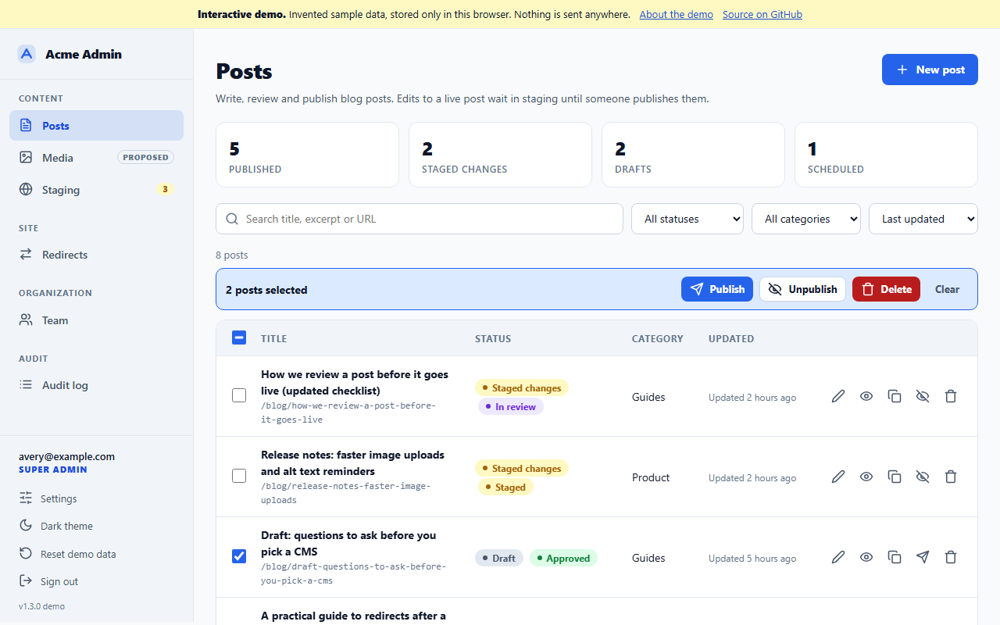
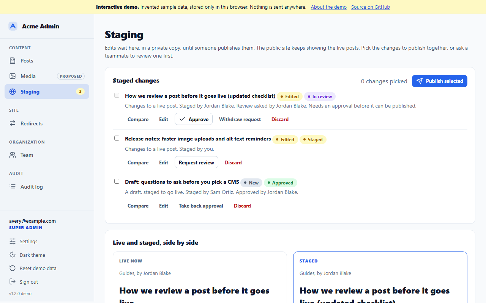
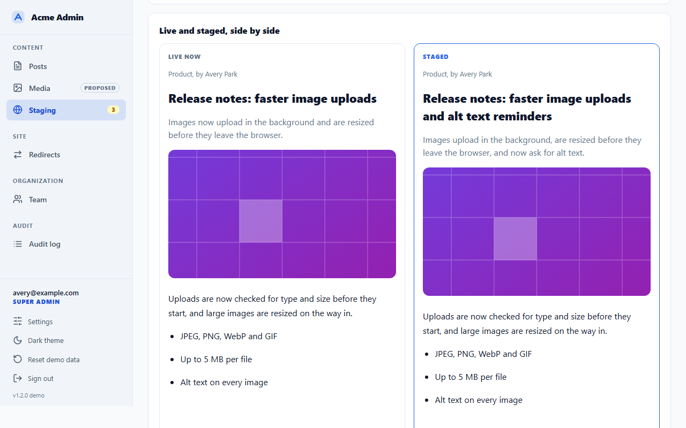
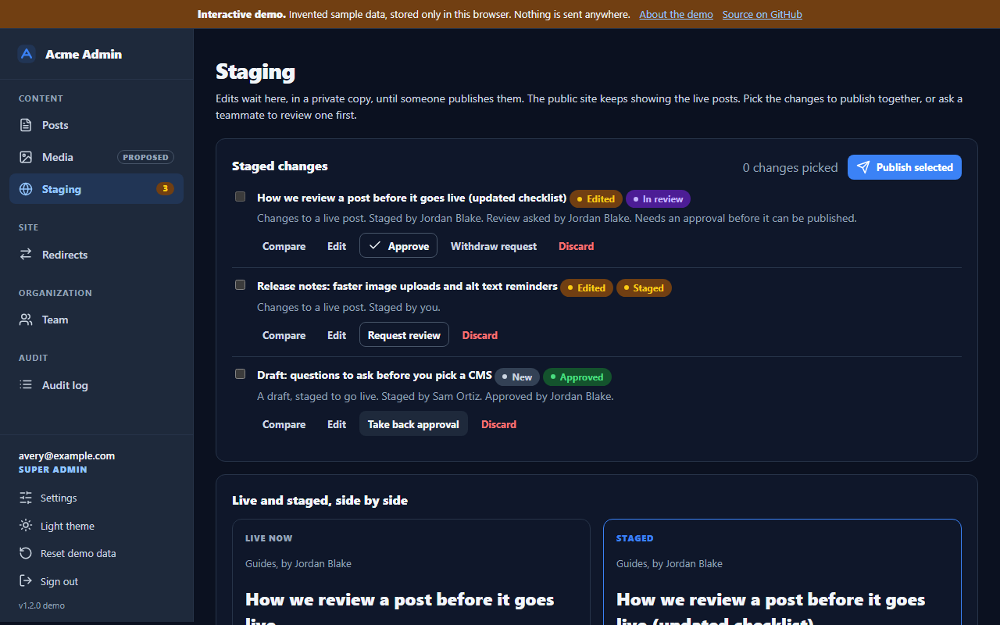
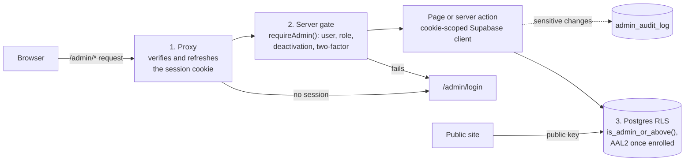
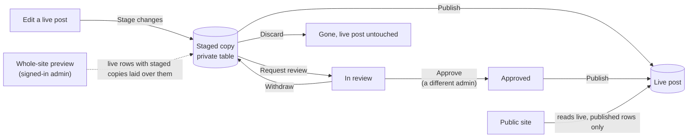

# Website CMS Kit

A complete, production-grade **admin, authentication and CMS backend** for a Next.js (App Router) and Supabase site, packaged as a reference you can study and reproduce on your own project.

It is the real backend of a production marketing site, extracted faithfully and white-labeled. Not a library you `npm install`: a worked example you read, understand and adapt. Everything here runs on Next.js and Supabase alone, with no third-party CMS and no separate backend service.

## Try it: interactive demo

**▶ https://robbrautigam.github.io/website-cms-kit/demo/**

A working version of the admin that runs entirely in your browser. Sign in with the pre-filled form (any password works), enter the two-factor code `123456`, then edit a live post without touching the live site, ask a teammate to review it, compare live and staged side by side, publish the changes you pick, invite a teammate and watch every step land in the audit log.

**Sample data only.** Everything in the demo is invented, saved only in your browser's local storage, and never sent anywhere. A few screens preview proposed features that are not in the source yet; the demo marks them **Proposed**. Details in [`demo/README.md`](demo/README.md).

| Posts | Editor |
|---|---|
| [](https://robbrautigam.github.io/website-cms-kit/demo/app/#/posts) | [](https://robbrautigam.github.io/website-cms-kit/demo/app/#/posts) |
| **Staging** | **Live and staged, side by side** |
| [](https://robbrautigam.github.io/website-cms-kit/demo/app/#/staging) | [](https://robbrautigam.github.io/website-cms-kit/demo/app/#/staging) |
| **Audit log** | **Dark theme** |
| [](https://robbrautigam.github.io/website-cms-kit/demo/app/#/audit) | [](https://robbrautigam.github.io/website-cms-kit/demo/app/#/staging) |

### A five-minute walkthrough

1. **Sign in.** Press Sign in, then enter `123456`. The two-factor step also offers a recovery code; using one turns two-factor off and makes you set it up again, as the real kit does.
2. **Edit a live post.** Open "Release notes: faster image uploads and alt text reminders", change a heading, add a link, insert an image (it asks for alt text). The live site keeps the published version; your edit is a staged change. The status line reads "Unsaved changes" until autosave lands, and the sidebar shows the post as a search result and a share card.
3. **Ask for a review.** Press Request review. Nobody approves their own change, so the demo offers "Demo: approve as" a teammate. Another post, "How we review a post before it goes live", is waiting for your approval.
4. **Preview and publish.** Open Staging, press Compare to see live and staged side by side, flip the whole site between Live site and Staging, then tick the changes you want and press Publish selected. A change still in review cannot be published.
5. **Bulk and settings.** Tick a few posts on the Posts page and publish or unpublish them together: each one is applied or skipped with its reason. In Settings, making new recovery codes asks for your password first.
6. **Team and audit.** Invite someone, change a role, try to demote the last super admin (refused), then find every step in the Audit log and export it.
7. **Start over.** "Reset demo data" in the sidebar puts everything back.

## What you get

- **Invite-only auth.** Email and password over `@supabase/ssr` cookie sessions, mandatory TOTP two-factor with bcrypt-hashed recovery codes, password reset, and forced two-factor enrollment after a grace window. No password is ever emailed.
- **Role-based authorization.** `super_admin` and `admin` roles, soft deactivation, and hardened Postgres RLS using `SECURITY DEFINER` helper functions (the recursion-free Supabase pattern).
- **Team management.** Invite, change role, deactivate and reactivate, operator-initiated password recovery, and a "cannot remove the last super admin" guard.
- **Staging and approval.** Edits to a live post wait in a private staged copy until someone publishes them; ask a teammate to review, approve (never your own change), compare live and staged, preview the whole site with every staged change, and publish the ones you pick together. See [below](#staging-and-approval).
- **Audit log.** An append-only record of every sensitive change (a database trigger refuses edits and deletes), with a filterable viewer and CSV export.
- **Hardened by default (1.3.0).** Security headers and a report-only Content Security Policy, one same-site check on every state-changing route, per-admin limits and output schemas on the AI routes, a server-only redirect counter, new recovery codes behind the password, private images until publish, and an opt-in database lock for real two-person control. See [docs/11](docs/11-hardening-and-everyday-comforts.md).
- **Everyday comforts (1.3.0).** Server autosave with an unsaved-changes warning, required alt text, a dark theme in the admin, bulk publish, unpublish and delete on the posts list, and a search and share-card preview for every post.
- **A repeatable CMS resource pattern.** Index, create, edit, server actions and RLS, shown with four real resources: blog posts (TipTap rich-text editor, autosave, draft, scheduled and published states, optional AI drafting), jobs, testimonials, and a URL redirect manager.
- **An accessible admin shell.** Responsive sidebar and drawer, focus-trapped modals, optimistic toggles, a neutral design-token system you re-theme in one file, and Supabase Storage image upload guarded by Storage RLS.
- **Three SQL migrations** that stand the whole thing up on a fresh Supabase project: the consolidated schema with its image bucket, staging and approval, then hardening. All three are tested on an in-memory Postgres, no Supabase project needed.

## How a request is checked

Three layers. Each refuses on its own what it checks, and the database is the layer every write passes through:


```mermaid
flowchart LR
  B["Browser"] -->|"/admin/* request"| P["1. Proxy<br/>verifies and refreshes<br/>the session cookie"]
  P -->|"no session"| L["/admin/login"]
  P --> G["2. Server gate<br/>requireAdmin(): user, role,<br/>deactivation, two-factor"]
  G -->|"fails"| L
  G --> S["Page or server action<br/>cookie-scoped Supabase client"]
  S --> R[("3. Postgres RLS<br/>is_admin_or_above(),<br/>AAL2 once enrolled")]
  S -.->|"sensitive changes"| A[("admin_audit_log")]
  V["Public site"] -->|"public key"| R
```

1. **The proxy** (`source/proxy.ts`) verifies and refreshes the session on every `/admin/*` request and bounces anyone without one to the login page.
2. **The server gate** (`requireAdmin()`) re-checks the user, their role, whether they were deactivated and whether two-factor is complete, on every protected page and every server-side mutation. API routes call it themselves, because the proxy does not cover `/api/*`. The editor's browser-side writes (posts, image uploads) skip this layer, so layer 3 carries the two-factor check for them.
3. **Row-level security** in Postgres is the final word: only active admins can write, an admin with two-factor set up needs a completed two-factor session for any admin read or write (tables and image bucket alike), and the public key can read published rows only. A leaked public key or a stolen password alone cannot change anything.

The full model, what it does not cover, and how to report a problem: [SECURITY.md](SECURITY.md).

## Staging and approval

Saving a published post no longer changes the live site. The edit is stored as a staged copy beside the live post, and the public site keeps reading the live row until someone publishes.


```mermaid
flowchart LR
  E["Edit a live post"] -->|"Stage changes"| S[("Staged copy<br/>private table")]
  S -->|"Request review"| R["In review"]
  R -->|"Approve<br/>(a different admin)"| A["Approved"]
  R -->|"Withdraw"| S
  S -->|"Publish"| L[("Live post")]
  A -->|"Publish"| L
  S -->|"Discard"| X["Gone, live post untouched"]
  V["Public site"] -->|"reads live, published rows only"| L
  P["Whole-site preview<br/>(signed-in admin)"] -.->|"live rows with staged copies laid over them"| S
```

- **A copy, never an overwrite.** One staged copy per post, in its own table. A brand-new draft can be staged too, so it goes through the same review.
- **Two people for an approval.** Nobody approves their own change, and editing an approved change sends it back to staged. The database enforces this with a trigger, whatever client writes the row. A change in review cannot be published while it stays in review; any admin can withdraw the request, and the audit log records who did.
- **Review is optional by default.** Any admin can still publish a staged change straight away. One switch in the migration and one constant make review mandatory; since 1.3.0 the same switch also turns on a database lock, so nothing reaches the public site, through the screens or the Data API, without a second admin's approval ([docs/11](docs/11-hardening-and-everyday-comforts.md#the-opt-in-two-person-lock)).
- **Publish the ones you pick.** The Staging page publishes a selection in one transaction: all of them or none.
- **The public site cannot read a staged row.** The public key has no grant and no policy on the table, and the public data layer never queries it. The preview reads staged rows only for a signed-in admin, through Next.js draft mode turned on by a form posted from the admin. Images uploaded while editing stay in a private bucket until their post goes live.
- **Every step is in the audit log:** staged, review requested, approved, withdrawn, discarded, published, and preview turned on.

The full model, the roles table and the tests: [docs/10-staging-and-approval.md](docs/10-staging-and-approval.md).

## Tests

The database rules, the staging rules, the route handlers and the hardening helpers are tested on PGlite and Node's test runner, Postgres compiled to WebAssembly, so no Supabase project or Docker is needed (Node 22.18 or later):

```bash
cd source/supabase/tests
npm install
npm test
```

The tests load all three migrations into an in-memory database with a small stand-in for Supabase's `auth` and `storage` schemas, then check every staging rule as the public key, a signed-in user without an admin role, a deactivated admin, an admin who has not set up two-factor yet, and admins with two-factor set up, both before and after they complete it in the session. The route tests run the real handlers against small stand-ins for Next.js and Supabase: the same-site check, the password before new recovery codes, the AI limits and schemas, the redirect counter and image promotion. 130 tests in all.

## 60-second tour

```
website-cms-kit/
  docs/        Read these. Start with 01-architecture.md.
  source/      The genericized source files, mirrored at the paths they belong
               at in a Next.js app's src/ directory.
  demo/        The interactive browser demo (sample data only).
  .env.example The environment variables the admin surface needs.
```

## How to use this

1. Read [docs/01-architecture.md](docs/01-architecture.md) for the mental model.
2. Skim [docs/02-authentication.md](docs/02-authentication.md) and [docs/03-authorization-and-rls.md](docs/03-authorization-and-rls.md), the two highest-value, easiest-to-get-wrong parts.
3. Follow [docs/07-reproduction-runbook.md](docs/07-reproduction-runbook.md) to stand it up on a fresh Next.js 16 and Supabase project.
4. Use [docs/05-cms-resource-pattern.md](docs/05-cms-resource-pattern.md) to add your own content types.
5. Gate your launch on [docs/08-security-checklist.md](docs/08-security-checklist.md).

## Documentation

| Doc | Covers |
|---|---|
| [01-architecture.md](docs/01-architecture.md) | The mental model, request lifecycle, directory map. |
| [02-authentication.md](docs/02-authentication.md) | Sessions, the four client factories, the proxy gate, every auth flow. |
| [03-authorization-and-rls.md](docs/03-authorization-and-rls.md) | Roles, the SECURITY DEFINER pattern, the standard RLS policy set, the audit log. |
| [04-team-management.md](docs/04-team-management.md) | Invite, role change, deactivate, recover. |
| [05-cms-resource-pattern.md](docs/05-cms-resource-pattern.md) | The repeatable resource shape and an "add your own" checklist. |
| [06-admin-shell-and-ui.md](docs/06-admin-shell-and-ui.md) | Shell, nav, primitives, design tokens, image upload. |
| [07-reproduction-runbook.md](docs/07-reproduction-runbook.md) | Step-by-step setup on a fresh project. |
| [08-security-checklist.md](docs/08-security-checklist.md) | The non-negotiables before you go live: secrets, RLS, gates, Storage, headers, rate limits. |
| [09-environment-and-deploy.md](docs/09-environment-and-deploy.md) | Env vars (both Supabase key generations), Supabase config, dependency classification, deploy. |
| [10-staging-and-approval.md](docs/10-staging-and-approval.md) | Staged copies of live posts, review and approval, the whole-site preview, publish-selected, and the tests. |
| [11-hardening-and-everyday-comforts.md](docs/11-hardening-and-everyday-comforts.md) | 1.3.0: headers and CSP, the same-site check, rate limits, AI output schemas, the append-only audit trigger, the two-person lock, private staged images, and the editor and posts-list comforts. |

## Tech stack

- Next.js 16 (App Router) and TypeScript
- Supabase: Postgres, Auth and Storage, through `@supabase/ssr` 0.10 or later
- Tailwind CSS v4
- TipTap 3 (rich text)
- zod (also the AI routes' output schemas), react-hook-form, sonner, lucide-react, bcryptjs, server-only
- Optional: `@anthropic-ai/sdk` for AI drafting
- Tests: Node's built-in test runner and PGlite 0.5.8 (Postgres 18 in WebAssembly)

The patterns were checked on 2026-10-08 against the releases current that day: Next.js 16 (16.4.0 is the newest; the changed files were type-checked against 16.3.8), `@supabase/ssr` 0.12.7, `@supabase/supabase-js` 2.117 and TipTap 3.31.4. What changed and why is in the [CHANGELOG](CHANGELOG.md).

## Status and provenance

Extracted from a production Next.js and Supabase marketing site and genericized for public release. All brand names, domains, emails, secrets and infrastructure identifiers have been removed; the placeholder brand is "Acme" on `example.com`. The code is faithful to the original system's structure and behavior.

It is a reference example, not a maintained package: there is no install target and no guarantee the extracted tree compiles standalone. The runbook explains how to wire it into a real app, where it does run.

## License

MIT. See [LICENSE](LICENSE). The demo bundles TipTap (MIT); see [demo/vendor/THIRD_PARTY_NOTICES.md](demo/vendor/THIRD_PARTY_NOTICES.md).
