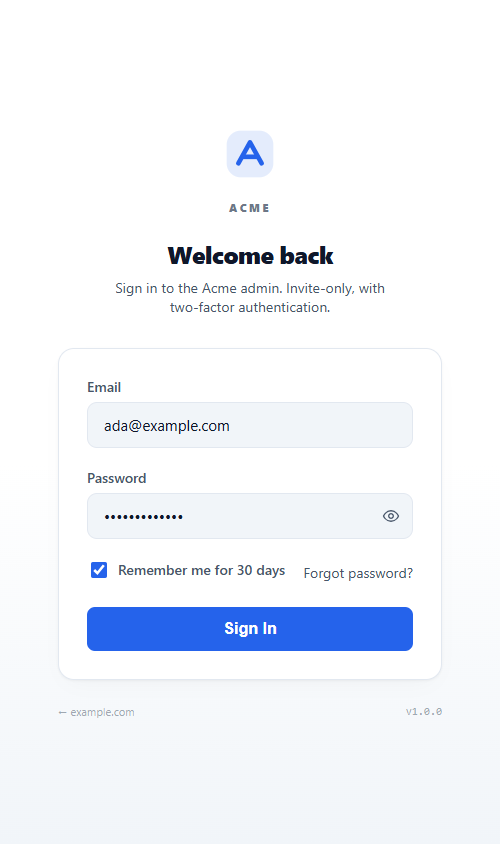

# Demo — visual tour

Static, **white-labeled** mockups of what this kit's admin surface looks like, built from the kit's own neutral design tokens (`source/app/globals.css`). The placeholder brand is **Acme** on `example.com`.

These are plain self-contained HTML files (inline CSS, no build, no data, no auth). They are a *visual* — the real, working implementation is the `source/` tree. Open them directly in a browser:

- [`login.html`](login.html) — the admin login screen (`AuthShell` + `LoginForm`): invite-only email + password, show/hide password, remember-me, two-factor hint.
- [`dashboard.html`](dashboard.html) — the admin shell (`AdminShell` + `AdminSidebar`) with the Posts list (`PostsTable`): sectioned nav, role badge, search + filters, status chips, row actions.

## Screenshots

### Admin login

### Admin dashboard (Posts)

### Login on mobile

## Re-theming

Every color here comes from the CSS variables in [`../source/app/globals.css`](../source/app/globals.css). The demo inlines the same neutral slate + blue palette. To see the whole surface re-theme, change the `:root` values in `globals.css` (the components reference semantic token classes like `bg-bg-card`, `text-accent`, `btn-primary`, never raw colors). The demo files inline a copy of those tokens so they render standalone.
