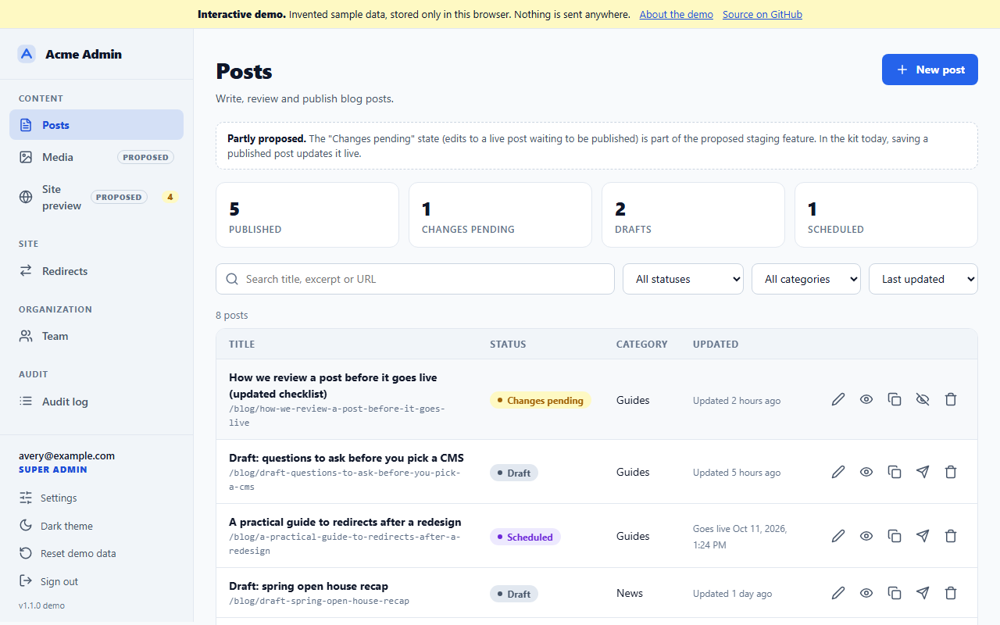
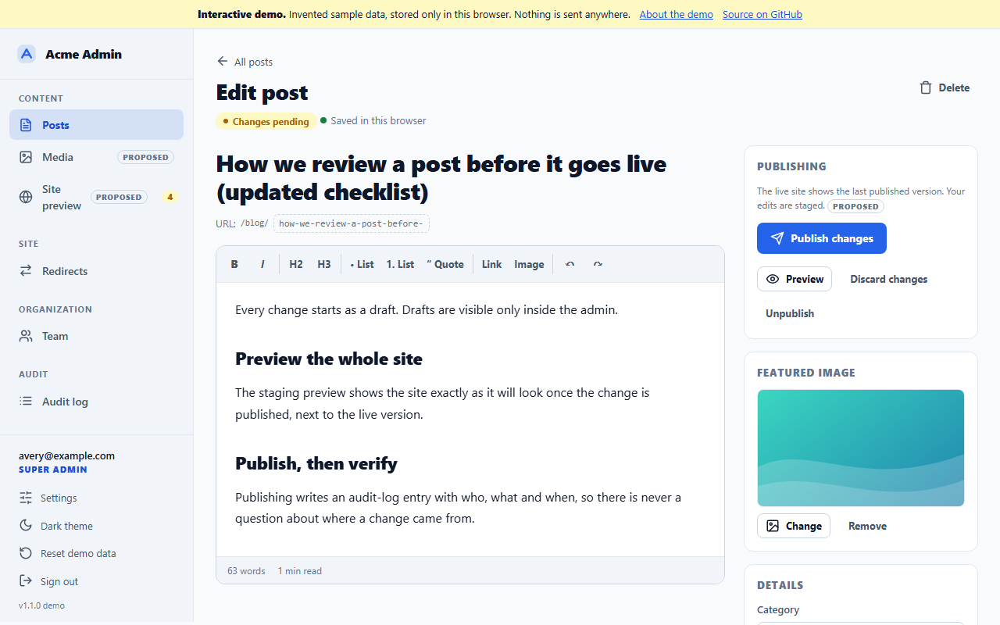
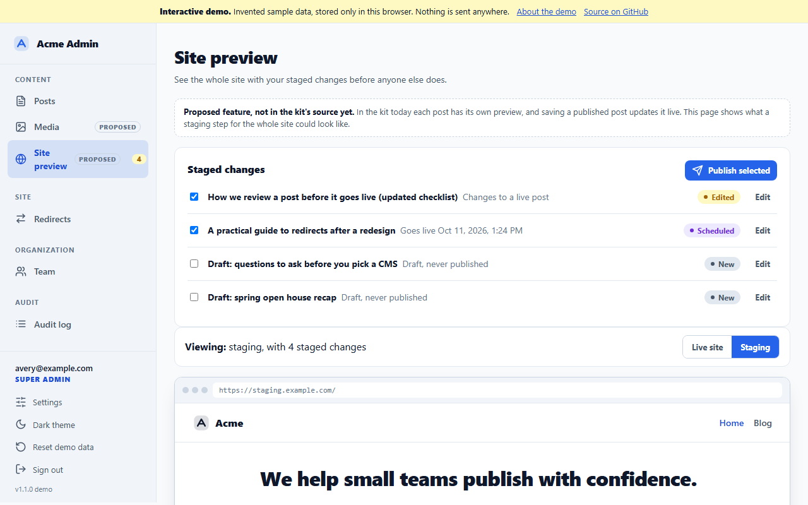
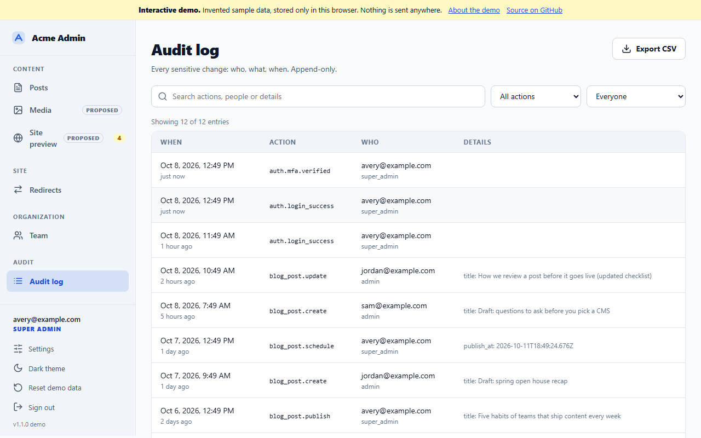
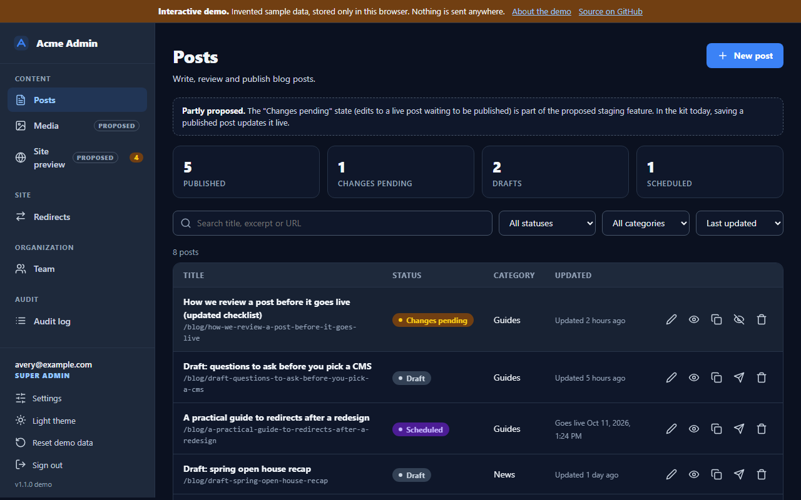
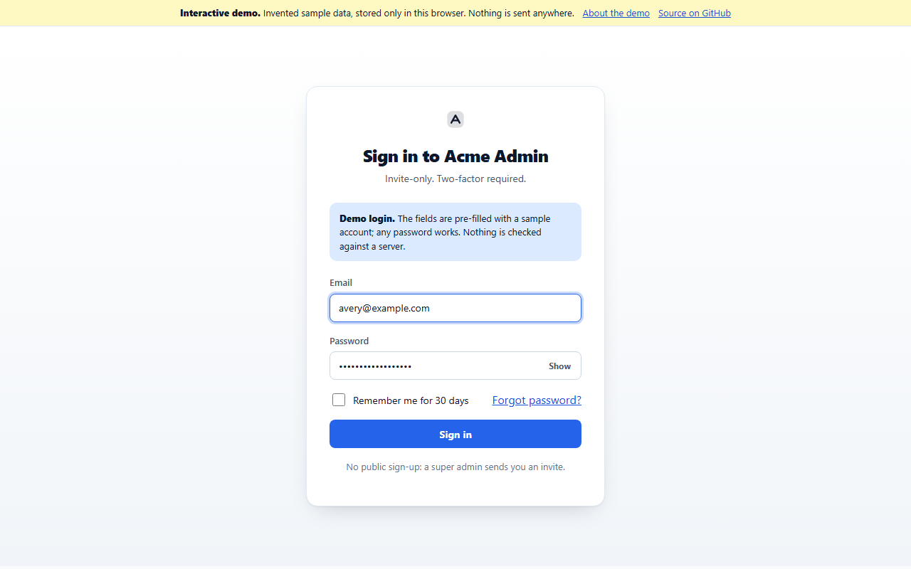
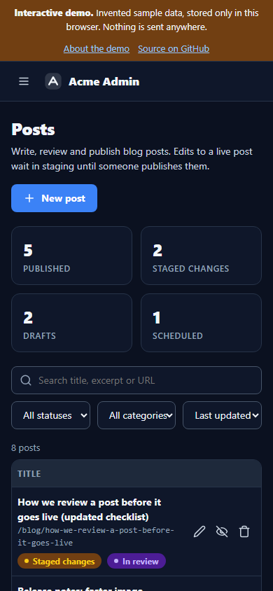
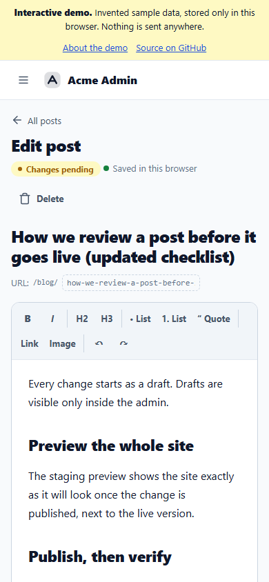

# Interactive demo

**Live:** https://robbrautigam.github.io/website-cms-kit/demo/ (landing page) and https://robbrautigam.github.io/website-cms-kit/demo/app/ (the demo itself).

A working, white-labeled version of the kit's admin that runs entirely in the browser. The placeholder brand is **Acme** on `example.com`.

**Sample data only.** Every post, person, image and log entry is invented. It is stored in your browser's `localStorage` and nothing is sent anywhere: there is no server, no database and no real sign-in. The production version of every screen is the Next.js and Supabase code in [`../source/`](../source/).

Sign in with the pre-filled form (any password works); the two-factor code is `123456`.

## In the kit today, and what is proposed

Most of the demo mirrors code in the kit's source today. A few screens preview features that are proposed but not built; the demo marks each one **Proposed** in the sidebar or on the page (a "Partly proposed" note where a page mixes the two).

| | |
|---|---|
| **In the kit's source today** | Invite-only sign-in, two-factor and recovery codes, posts with draft, scheduled and published states, a per-post preview, local autosave, the TipTap editor, image upload from the post form, team management, the audit log with CSV export, redirects. (The kit also has jobs, testimonials, a sitemap view and a help page, which the demo leaves out.) |
| **Proposed, previewed in the demo** | Staged edits on a live post and the "Changes pending" state (the kit today updates a live post on save), the whole-site staging preview with publish-selected, the media library page, resending or cancelling an invite, and the redirect tester with its loop, chain, duplicate and reserved-path checks. |
| **Demo-only helpers** | The light and dark theme switch (the kit documents how to add one), viewing the admin as another role, reset demo data. |

## What works

| Area | In the demo |
|---|---|
| Sign-in | Demo login, show or hide password, remember me, forgot password, two-factor step, recovery codes (using one turns two-factor off and forces setup again, as in the kit). |
| Posts | Status counts, search, status and category filters, sort, edit, preview, duplicate, publish, unpublish, delete. |
| Editor | TipTap rich-text editor with the kit's toolbar (headings, bold, italic, lists, quote, links with a scheme allowlist, images), autosave, URL slug check, word count, schedule, publish, discard staged changes. |
| States | Draft, scheduled, published, and published with staged changes. A live post keeps showing its last published version until you publish the edits. |
| Site preview | The whole site with every staged change, a live and staging toggle, and publish-selected. |
| Media | Upload (JPEG, PNG, WebP or GIF up to 5 MB, resized in the browser), alt text, delete, pick as a featured or inline image. |
| Team | Invite, change role, turn access off and on, reset link, the last-super-admin guard; resend or cancel an invite (proposed). |
| Audit log | Every action above, filter by type and person, search, 50 rows a page, CSV export (with spreadsheet formula injection neutralized). |
| Redirects | Add, edit, toggle, delete, and the kit's path and destination checks; a path tester and checks for loops, duplicates, reserved paths and two-hop chains (proposed). |
| Settings | Light, dark or system theme, new recovery codes, two-factor off and on, change password with live rules, view the admin as an `admin` instead of a `super_admin`, reset demo data. |

It works at phone and desktop widths, in light and dark themes, with the keyboard alone, and with a screen reader (labeled controls, focus moved to each page's heading, focus-trapped dialogs, announced notifications).

## How it is built

- Plain HTML, CSS and JavaScript in [`app/`](app/). No build step and no framework.
- A strict Content Security Policy (`default-src 'self'`, no inline script, no inline style, `connect-src 'none'`), so the page cannot send data anywhere even by mistake.
- The editor is [TipTap](https://tiptap.dev) 3.31.4, bundled once into [`vendor/tiptap-3.31.4.min.js`](vendor/) with its license notices in [`vendor/THIRD_PARTY_NOTICES.md`](vendor/THIRD_PARTY_NOTICES.md). TipTap's own style injection is turned off and its base CSS lives in `app.css`, the same setup the security checklist recommends for a strict CSP.
- Colors come from the kit's design tokens, with one `[data-theme="dark"]` override block.

## Screenshots

| | |
|---|---|
|  |  |
|  |  |
|  |  |

Phone:  

## Run it locally

Any static file server works, for example from the repository root:

```bash
python -m http.server 8000
# then open http://localhost:8000/demo/
```

The old static mockups (`login.html`, `dashboard.html`) now forward to the working demo.
