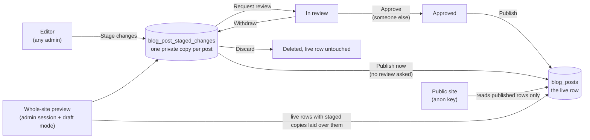

# 10 - Staging and Approval

How an edit waits beside the live post until someone publishes it, who may move it along, how the whole site is previewed with every staged change, and what the audit log records. The SQL is `source/supabase/migrations/001_staging_and_approval.sql`; the tests are in `source/supabase/tests/`.

## The problem it solves

Without staging, saving a published post changes the live site at once: there is no look first and no second pair of eyes. Staging keeps the live post exactly as it is while edits wait in a separate, private copy. The site goes on serving the live row until a person publishes the staged copy.

## The model in one picture



## Where a staged edit is stored

A staged edit is a **copy, never an overwrite**. It lives in its own table, `blog_post_staged_changes`, one row per post at most (`post_id` is unique), holding the same editable fields as the post: title, slug, excerpt, body, categories, featured image and alt text, search description and author. The `blog_posts` row is not touched until the change is published.

This is the shape the mature systems use. Payload keeps a published document in its collection and newer drafts in a separate versions table, and a document with both is in a "Changed" state. Sanity keeps a draft as a separate document under a private `drafts.` path that unauthenticated requests never see. The kit does the same with a separate table that the public key cannot read at all.

| Post status | Staged copy | What the public site shows | What the staging preview shows |
|---|---|---|---|
| Published | none | the live row | the live row |
| Published | yes | the live row | the staged copy |
| Draft or scheduled | none | nothing | nothing (a draft is not proposed for the site until it is staged) |
| Draft or scheduled | yes | nothing | the staged copy, marked "New" (publishing it makes a draft live now; a scheduled post keeps its date) |

A draft that has never been published can be staged too ("Stage for publishing"), so a new post goes through the same review as an edit.

## Review states

A staged change carries a `review_status`:

| State | Meaning | Who moves it on |
|---|---|---|
| `staged` | Saved for later, not yet sent for review | Anyone can publish it now, request review, edit it or discard it |
| `in_review` | Someone asked a teammate to check it | Another admin approves it; the requester or anyone can withdraw the request; it cannot be published while waiting |
| `approved` | A second person signed off on this exact content | Anyone can publish it; editing it sends it back to `staged` |

The database enforces the transitions with a trigger, so they hold however the row is written (server action, browser client or a hand-made API call):

1. A new staged change always starts as `staged`, with `staged_by` set to the caller. A client cannot insert a row that is already approved.
2. Any change to the content resets the row to `staged` and clears the review request and the approval. An approval covers the exact content that was approved, nothing edited after.
3. `staged` to `in_review` records who asked and when.
4. `in_review` to `approved` is refused when the approver is the person who staged the content (`staged_by`). Two people, always.
5. `in_review` or `approved` back to `staged` (withdraw, or take back an approval) clears the review fields.
6. Every other jump (for example `staged` straight to `approved`) is refused, and the bookkeeping columns (`staged_by`, `approved_by` and their times, `post_id`) cannot be written directly.

## Who may do what

The kit has two live roles (`super_admin` and `admin`, see [03](03-authorization-and-rls.md)). Both are content managers, so staging gives them the same powers. The one rule that depends on the person, not the role, is that nobody approves their own change.

| Action | Who | Where it is enforced |
|---|---|---|
| Stage changes, edit a staged change | Any active admin on a two-factor (AAL2) session | `requireAdmin()` in the server action; RLS on the table (admin plus the two-factor rule) |
| Request review, withdraw a request | Any active admin, AAL2 | Same, plus the trigger's transition rules |
| Approve | Any active admin, AAL2, who did not stage the content | Same, plus the trigger's "not your own change" rule |
| Publish selected, Publish now | Any active admin, AAL2; a change waiting in review cannot be published while it stays in review (any admin can withdraw the request; "Publish now" refuses it) | `publish_staged_posts()`, which runs with the caller's rights (`security invoker`), so RLS on both tables applies |
| Discard | Any active admin, AAL2 | RLS delete policy |
| Read a staged change | Active admins only, AAL2 once they have a factor | RLS; `anon` has no grant on the table at all |

**Making review mandatory.** By default review is opt-in per change: "Publish now" works on a change nobody asked to review, the way publishing works today. Changing `false` to `true` in two places, `public.staging_review_required()` in the migration and `REVIEW_REQUIRED` in `lib/staging/rules.ts`, makes the staging screens and `publish_staged_posts()` refuse every change that is not `approved`; hide "Publish now" in the editor too. The tests cover both settings.

**What the switch does not do.** It does not stop an admin writing `blog_posts` directly: the editor's Update on a draft with no staged copy, the posts list's publish button, creating a post as Published, or a call to the Data API with an admin session. A team that needs real two-person control must also lock those paths: route the editor and the posts list through staging, and refuse direct content and status writes on `blog_posts` in the database. Since 1.3.0, migration 002 does the database half: with the switch on, a trigger on `blog_posts` lets an admin edit a draft freely and take a post down, but refuses any change that puts content on the public site unless it is exactly an approved staged change ([docs/11](11-hardening-and-everyday-comforts.md#the-opt-in-two-person-lock)).

## Publishing

`publish_staged_posts(stage_ids uuid[])` is one SQL function, so publishing the changes you pick is **all or nothing**: either every picked change goes live or none does. For each staged change it:

1. Locks the staged row (`for update`) and refuses one that is waiting in review.
2. Copies the staged fields onto the live `blog_posts` row, sets `status = 'published'` and keeps the original `published_at` (a first publish sets it to now). A scheduled post keeps `status = 'scheduled'` and its date: only its content changes.
3. Deletes the staged row.

It returns the published post ids. A slug that another live post already uses fails the whole batch with Postgres's unique-violation code, which `wrapSupabaseError()` turns into a friendly "already exists" message. The function runs as the caller (`security invoker`), not as its owner: a function that bypassed RLS and sat in an exposed schema would be callable by anyone holding a session (Supabase's own guidance on `security definer`), so this one gets no extra powers at all.

"Publish now" in the editor is two steps in one click: save the editor's content to the staged copy, then publish that one change. If the publish fails (a slug clash, a lost session), the work is still safe in the staged copy.

## The public site reads live rows only

Three locks keep a staged change off the public site:

1. **No grant.** The migration revokes every privilege on `blog_post_staged_changes` from `anon`, so the public key gets "permission denied" before RLS is even consulted.
2. **No anon policy.** RLS is on and the only policies are for active admins. A future `grant` by mistake would still return no rows.
3. **The public data layer never asks.** `lib/data.ts` reads `blog_posts` with the anon client and knows nothing about staging. Only the preview helpers in `lib/staging/preview.ts` read staged rows, and only with the signed-in admin's own cookie session.

The tests prove the first two with the database itself: as `anon`, selecting the staged table fails with permission denied, a mistaken `grant` still returns no rows, and calling the publish function is refused.

## How the rules are tested

`source/supabase/tests/staging.test.mjs` loads migrations 000 and 001 into PGlite (real Postgres compiled to WebAssembly, so no Supabase project or network) and switches identity the way the Data API does: a role (`anon` or `authenticated`) plus the request's JWT claims (`sub`, `aal`). Every rule on this page has a test, and every test was first seen failing: once with migration 001 missing, then by breaking each rule in a copy of the migration (removing the anon revoke, the two-factor policy, the not-your-own-approval check, the in-review block, the content reset, `security invoker`, and seventeen more) and confirming at least one test went red for each.

## The whole-site preview

There are two previews, both behind the admin's own session:

1. **The staging page, `/admin/staging`.** It lists every staged change with its review state, lets you pick changes and publish them together, request review, approve, withdraw and discard, and shows the blog as it is live beside the blog as it will be once the staged changes are published.
2. **Your real pages with staged content, through Next.js draft mode.** "Open the staged site" is a small form that posts `path=/blog` to `POST /api/admin/preview`. The route refuses a request from another site (the `Origin` header must match the site's public origin, read from the proxy's `X-Forwarded-Host`, then the `Host` header, because under `next start` behind a proxy `request.url` carries the server's bind address; with no `Origin`, `Sec-Fetch-Site` must say `same-origin`), runs `requireAdmin()`, accepts only an on-site path (one leading slash, never `//` or a backslash), turns on draft mode, records an audit row and redirects. It is a POST and not a link because it changes a cookie: a link on another site could otherwise switch it on. Your public pages then branch on draft mode:

```tsx
// app/blog/[slug]/page.tsx (your site's own page)
import { draftMode } from 'next/headers'
import { getBlogPost } from '@/lib/data'
import { getPreviewPost } from '@/lib/staging/preview'

export default async function Page({ params }: { params: Promise<{ slug: string }> }) {
  const { slug } = await params
  const { isEnabled } = await draftMode()
  const post = (isEnabled && (await getPreviewPost(slug))) || (await getBlogPost(slug))
  // ...render post
}
```

Draft mode is a cache switch, not a login: Next.js sets a `__prerender_bypass` cookie and skips its caches for that browser. The kit never trusts that cookie on its own. `getPreviewPost()` and `getPreviewPosts()` first check that the visitor is an active admin on an AAL2 session and return `null` otherwise, and they read staged rows with the visitor's own session, so RLS decides again. Someone who copies the cookie into another browser sees the live site. "Exit preview" is a form that posts to `/api/admin/preview/exit`, which turns draft mode off (a plain link could be prefetched and end the preview by accident, the Next.js guide warns).

## What the audit log records

Every step writes one `admin_audit_log` row through `recordAdminAction()`, with the actor, the post and a payload:

| Action | When | Payload |
|---|---|---|
| `blog_post.stage` | A staged change is created or its content saved | `title`, `slug`, `created` (true for a new staged change) |
| `blog_post.request_review` | `staged` to `in_review` | `title` |
| `blog_post.approve` | `in_review` to `approved` | `title`, `staged_by` |
| `blog_post.withdraw_review` | `in_review` or `approved` back to `staged` | `title`, `from` |
| `blog_post.discard_staged` | A staged change is deleted | `title` |
| `blog_post.publish_staged` | One row per post published from staging | `title`, `slug`, `review_status`, `approved_by`, `batch` (how many went together) |
| `staging.preview_enabled` | Draft-mode preview turned on | `path` |

The review columns on the staged row (`staged_by`, `review_requested_by`, `approved_by` and their times) are the live state; the audit log is the history that stays after the staged row is published and deleted.

## Files

| File | What it is |
|---|---|
| `source/supabase/migrations/001_staging_and_approval.sql` | The table, its grants, RLS, the two-factor rule, the review trigger and `publish_staged_posts()` |
| `source/supabase/tests/` | The database tests (RLS, grants, transitions, publishing) on an in-memory Postgres (PGlite), plus a stand-in for the parts of Supabase they need; `npm install && npm test` in that folder runs them and the rules tests |
| `source/lib/staging/rules.ts` | The same rules for the UI: which buttons to show, which picks can publish, which fields a staged copy may hold, which preview paths and requests are accepted; tested by `rules.test.mjs` |
| `source/lib/staging/queries.ts` | Server reads for the editor, the posts list and the staging page |
| `source/lib/staging/preview.ts` | The draft-mode preview reads, admin-only |
| `source/app/(admin)/admin/staging/` | The staging page and its server actions |
| `source/app/api/admin/preview/` | Turn draft mode on (admin only, on-site paths only) and off |
| `source/components/admin/PostForm.tsx`, `PostsTable.tsx` | "Stage changes" and "Publish now" in the editor, the Staged badge on the list |

## Limits, on purpose

- **Posts only.** Jobs, testimonials and redirects still save live. The same table, trigger and function shape applies to each; copy the posts block.
- **One staged copy per post.** Two people editing the same live post edit the same staged copy, the way Sanity keeps one draft per document. Saving resets any approval, so nobody publishes content that changed after it was approved.
- **No history of staged versions.** Publishing deletes the staged row; the audit log keeps who did what, not the old text. Revisions (every save kept, compare, restore) is the next feature and builds on this table.
- **Scheduled posts are separate.** A scheduled post goes live by its own date; staging does not schedule. Publishing a scheduled post's staged copy updates the content it will go live with and keeps its status and date.
- **Images are public by URL from upload.** Staged text is private, but an image uploaded while editing a staged change goes to the public `blog-images` bucket at once. Its random name keeps it unguessable, not access-controlled.
- **A slug swap needs two steps.** Publishing two staged changes that swap slugs in one batch fails on the unique slug. Publish one under a temporary slug first.
- **A change in review can be withdrawn by any admin.** "A change in review cannot be published" holds while it stays in review; withdrawing the request (Staging page) makes it publishable again, and the audit log records who withdrew it. Changing the content of a change in review also takes it out of review, and the audit log records that as a withdrawal. "Publish now" refuses a change in review.
